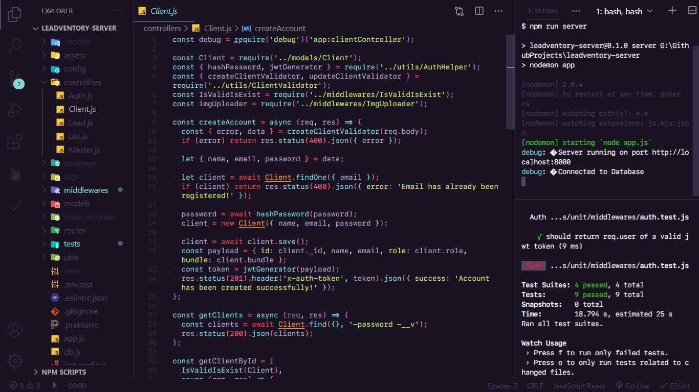
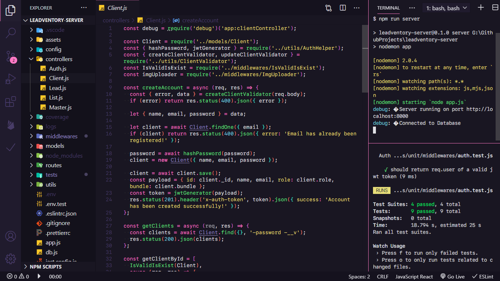
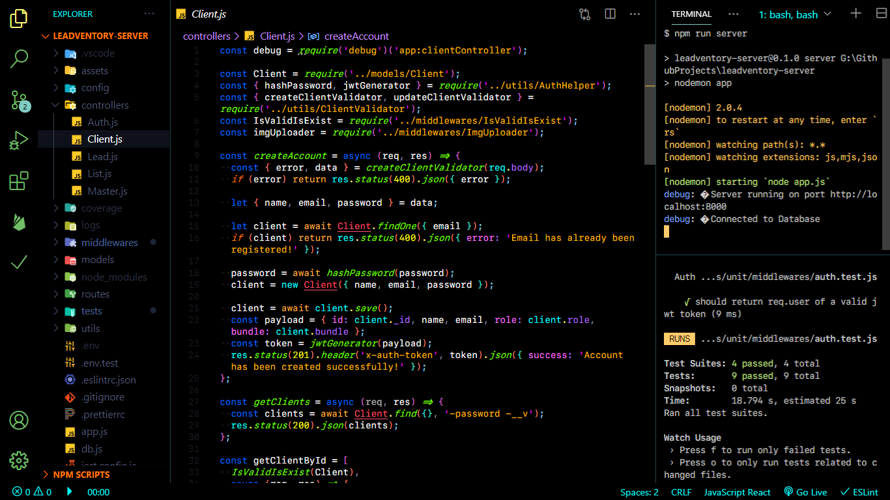
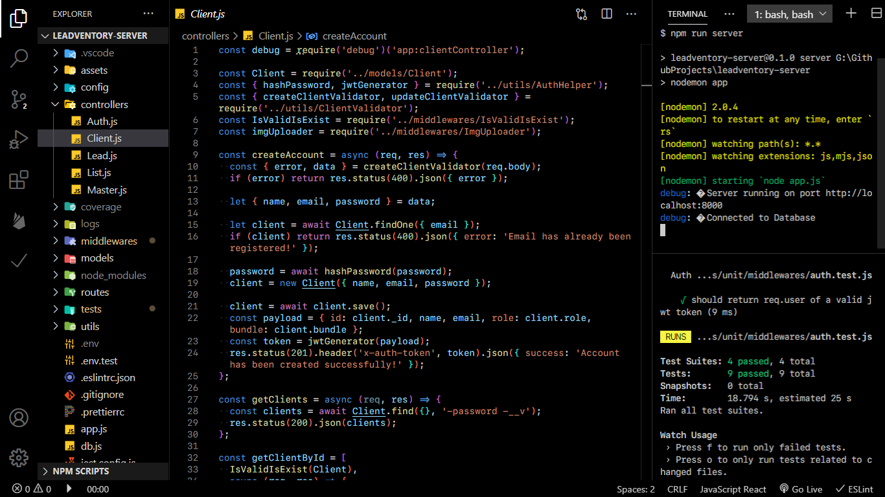

<div align="center">
  
</div>

<h1 align="center">
  BADBUG Theme
  
</h1>

<h4 align="center">

🔥 A collection of beautifully crafted modern themes 🎨 + 👌

</h4>

<div align="center">
  


</div>

## Installation

1. Open the extensions sidebar on Visual Studio Code
2. Search for **BADBUG Theme**
3. Click **Install** to install it.
4. Click **Reload** to reload the your editor
5. File > Preferences > Color Theme > **BADBUG - `<Theme>`**

## BADBUG - Elegant



## BADBUG - Dracula



## BADBUG - Retro



## BADBUG - Black



### Settings

Settings - I'm using for my ultimate vs code setup.

```json
  /* Editor Theme and Font Setting*/
  "editor.fontFamily": "SF Mono",
  "editor.fontSize": 12,
  "editor.fontWeight": "400",
  "editor.lineHeight": 15,
  "editor.fontLigatures": true,
  "terminal.integrated.fontFamily": "SF Mono",
  "terminal.integrated.fontSize": 12,
  "debug.console.fontSize": 12,
  "workbench.iconTheme": "material-icon-theme",
  "workbench.colorTheme": "BADBUG - Elegant",

  /* Editor Config */
  "editor.wrappingStrategy": "advanced",
  "editor.wordWrap": "bounded",
  "editor.wordWrapColumn": 120,
  "editor.renderIndentGuides": false,
  "editor.renameOnType": true,
  "editor.renderControlCharacters": true,
  "editor.renderWhitespace": "boundary",
  "editor.minimap.enabled": false,
  "editor.selectionHighlight": false,
  "editor.roundedSelection": false,
  "editor.parameterHints.enabled": false,
  "editor.suggestSelection": "first",
  "workbench.editor.tabSizing": "shrink",
  "breadcrumbs.enabled": false,

  /* General Config */
  "explorer.confirmDragAndDrop": false,
  "explorer.confirmDelete": false,
  "window.zoomLevel": 1,
  "window.menuBarVisibility": "toggle",
  "files.autoSave": "onFocusChange",

  // Bracket Pair Colorizer 2
  "bracket-pair-colorizer-2.colors": ["Orchid", "Salmon", "Turquoise"],
  "bracket-pair-colorizer-2.showHorizontalScopeLine": false,
  "bracket-pair-colorizer-2.showVerticalScopeLine": false,
```

<hr>

> These are my favorite themes and over the last few months I tweaked these themes and add my own spins. The original themes can be found here - [LevelUp]('https://marketplace.visualstudio.com/items?itemName=leveluptutorials.theme-levelup') (Elegant), [Pitch Black Theme](https://marketplace.visualstudio.com/items?itemName=viktorqvarfordt.vscode-pitch-black-theme) (Black), [Just Black](https://marketplace.visualstudio.com/items?itemName=nur.just-black) (Retro), and [Dracula Official](https://marketplace.visualstudio.com/items?itemName=dracula-theme.theme-dracula) (Dracula).
